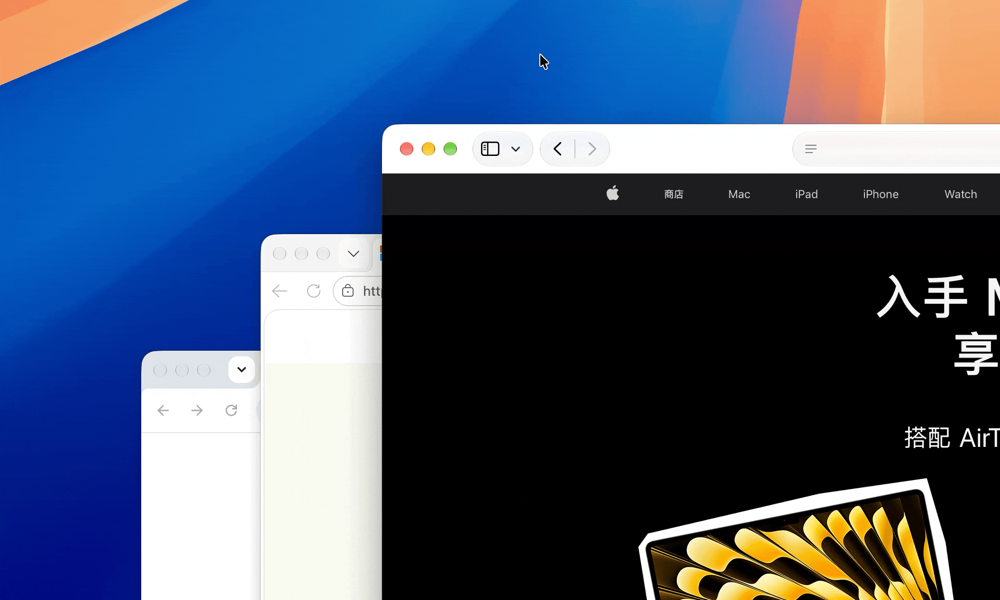

English | [中文](./README_zh.md)

# FocusTrafficLight

A macOS menu bar app that automatically manages window focus recovery.



When you close, minimize, or hide a window, focus automatically moves to the next visible
window — the same way it would if you had picked it yourself, so you never have to reach
for the mouse or `Cmd+Tab` afterwards.

## Features

- **Automatic Focus Recovery**: After closing, minimizing, or hiding a window, automatically focuses on the topmost visible window
- **Close and Minimize Triggers**: Works with `Cmd+W`, `Cmd+M`, and clicking the red close or yellow minimize traffic light buttons
- **App Hide Support**: WeChat, QQ, Feishu, and other apps with their own hide shortcuts focus the next window after hiding
- **Broad Compatibility**: Works with regular apps and non-standard windows such as v2rayN and Keynote save panels
- **Menu Bar Control**: Clean menu bar interface with one-click toggle

## Requirements

- **macOS 27 or later**: use this version (v5.x)
- **macOS 15 or earlier**: use the **V4 release** — [v4.0.6](https://github.com/xdzgithub/FocusTrafficLight/releases/tag/v4.0.6)
- Accessibility permission required

## Installation

1. Download `Focus TrafficLight.zip`
2. Extract and drag to Applications folder
3. Grant Accessibility permission on first launch, **restart the app after granting permission**

## Usage

- Click menu bar icon to view status
- "Enable Focus" toggle to enable/disable focus recovery
- "Launch at Login" to set startup behavior

## Troubleshooting

The app logs its decision path to the unified log. To watch it, run:

```sh
log stream --predicate 'subsystem == "com.focustrafficlight.app"' --level notice
```

Healthy output shows `Permissions — accessibility=true`, `Traffic light mouse tap created`, then
`Focus trigger queued` → `Focus check triggered` → `Focusing: <app>` → `Activate <app> via … frontmost=true`.

## Privacy

This app requires Accessibility permission to monitor window events. The permission is only used for focus management. No user data is collected or transmitted.
